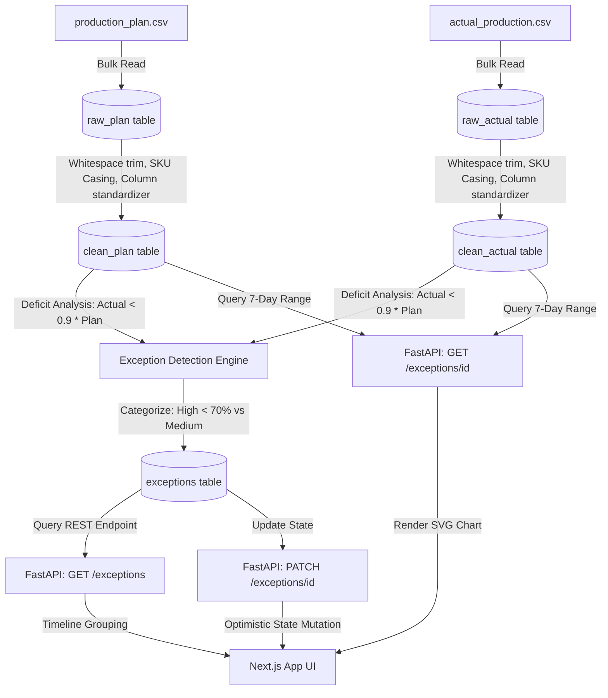

# Approach — Mini Exception Inbox

## Problem Breakdown

To solve the exception management task, I broke the project down into five distinct phases, working from data pipelines upward to UI controls:

1. **Exploration (1 hour)**: Inspected the CSV files directly to discover formatting irregularities, column schema naming differences, and data ranges (both CSVs span Jan 1, 2017 to Mar 31, 2017).
2. **Database Ingestion & Cleaning (1.5 hours)**: Designed SQL models for raw, clean, and exceptions tables. Wrote the `seed.py` cleaning module utilizing Pandas to automate column mapping and data sanitization.
3. **API Implementation (1.5 hours)**: Built REST API endpoints with FastAPI. Integrated sorting constraints (date desc, worst deficit percentage first) and calculated the 7-day trend history logic.
4. **UI Design & Core Development (3 hours)**: Developed a modern Next.js client dashboard. Crafted the collapsible timeline, severity filters, custom SVG rendering for plan-vs-actual trends, and instant state-mutation action buttons.
5. **Dockerization & Testing (1 hour)**: Wrote Dockerfiles and `docker-compose.yml` to bundle the stack. Verified end-to-end integration and verified system compilation.

Total project time: ~8 hours.

---

## Process Flow Diagram

Here is the data pipeline flow, showing ingestion, sanitization, exception calculation, and delivery to the user interface:

---

## Data Decisions

Looking closely at the CSV logs, I discovered and resolved several data quality issues:
- **Casing and Trim Inconsistencies**: The SKUs in `production_plan.csv` contained mixed casing and leading/trailing spaces (e.g., `' fg-007 '` vs `'FG-007'`). I solved this by calling `.strip().upper()` on all SKUs/product codes during clean mapping.
- **Floating Point Plan Units**: The plan CSV reported planned units as floats (e.g., `61.0`), while actual production used integers. I standardized planned units to integers using `int(round(value))` to ensure calculations compare whole units.
- **Mismatched Column Headers**: Handled header mapping during ingestion:
  - Plan: `plan_date` -> `date`, `sku` -> `product_code`, `plant` -> `plant_id`.
  - Actual: `date` -> `date`, `product_code` -> `product_code`, `plant_id` -> `plant_id`.

---

## Schema & Why

I chose SQLite with a separate staging pattern to ensure high-fidelity audits:
- **`raw_plan` / `raw_actual`**: Holds data exactly as written in the CSVs, allowing developers to inspect source entries without reloading raw CSV text.
- **`clean_plan` / `clean_actual`**: Contains normalized, typed data with indexes on `product_code` and `date` to run exception detection queries efficiently.
- **`exceptions`**: Stores calculated exception cards. Materializing exceptions into a table (instead of querying on-the-fly) ensures:
  1. Exception states (open, acknowledged, resolved) persist across sessions.
  2. Frontend queries run at sub-millisecond speeds, avoiding complex joins.

---

## API Design Notes

- **Sorting**: Handled sorting in the SQL query itself (`order_by(desc(ExceptionItem.date), desc(ExceptionItem.deficit_pct))`). This reduces frontend computation.
- **Trend Calculation**: The `GET /exceptions/{id}` endpoint aggregates data for the specific SKU starting 6 days before the exception date up to the exception date itself (`date - 6` to `date`). This guarantees a continuous 7-day trend line.
- **CORS Configuration**: Enabled CORS to allow Next.js on port 3000 to securely hit our Python server on port 8000.

---

## Tradeoffs & Shortcuts

- **Single-Database Instance**: In a massive production system, raw data ingestion and analytical batch calculations (like exception checks) should run on separate read/write instances. For this scope, SQLite handles both workloads with ease.
- **Static Seed Script**: Re-running `seed.py` wipes the database and re-detects exceptions. In a real-world system, this would be an incremental background cron or a trigger-based calculation when actuals are submitted.

---

## Next Steps

If I had more time, I would:
1. **Add Real-time WebSockets**: Push new exceptions to the timeline inbox dynamically without asking the user to manually sync or reload.
2. **Add Interactive Comment Threads**: Allow planners to add text explanations (e.g., "Machine breakdown", "Supply shortage") when acknowledging or resolving exceptions, persisting comments alongside status updates.
3. **Advanced Trend Charting**: Enhance the SVG trend visualization to allow date range extensions (14-day or 30-day views).
